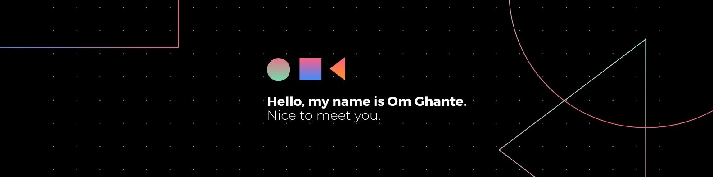

<h1 align="center">Hi 👋, I'm Om Deepak Ghante</h1>
<h3 align="center">A passionate Fullstack developer from India</h3>

- 🌱 I’m currently learning **React, Nextjs**

- 👨‍💻 All of my projects are available at [https://www.omghante.com](https://www.omghante.com)

- 💬 Ask me about **Android or Web Dev**

- 📫 How to reach me **mr.omghane1@gmail.com**

<h3 align="left">Connect with me:</h3>

